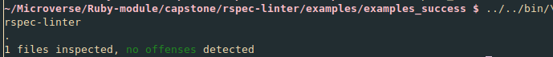
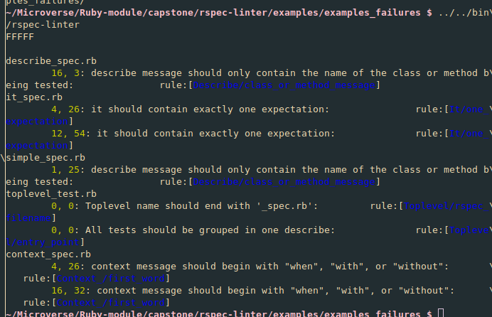

# rspec-linter

A linter to help enforcing consistent styling to rspec test suites.
The style guidelines are a subset of those found at [betterspecs.org](https://www.betterspecs.org/)

> This project was originally proposed by [Microverse](https://www.microverse.org/)

## Getting Started

### Prerequisites

Ruby and Bundler must be installed on your computer (versions 3.0.1 and 2.2.15, respectively).
You'll need to have git installed to download the repository.

**To use the code in this project, you'll need to have Ruby and the gem bundle installed in your computer.**


### Instalation
To get a local copy up and running follow the following simple steps:

On GitHub bash, or a unix-like terminal:

- To clone the project to your machine, run `git clone https://github.com/notlfish/rspec-linter.git`.
- To enter the project folder, run `cd rspec-linter`.
- To install the required dependencies, run `bundle install`.
- In linux or mac, run `export PATH=$PWD/bin:$PATH` from the project folder to add the executable
to your path (you'll need this to call rspec-linter from any folder).

### Usage
After completing the [instalation](#instalation) intruction, go to the folder of your terminal and run
`rspec-linter`. rspec-linter will run on all your files whose names end with "_test.rb" or "_spec.rb"
in the folder from where it's called or on its "spec" subfolder.

For you to be able to use rspec-linter by running `rspec-linter` you have to complete the last installation
step, and stay in the same terminal session. Otherwise you'll have to call rspec linter using
`<path to rspec-linter folder>/bin/rspec-linter`.

## Rules
This is a linter that works on rspec test suites and only seeks to enforce consistent styling in the
usage of rspec funcitonality. For general ruby styling, use [rubocop](https://github.com/rubocop/rubocop).

The following rules are implemented:

### Test file naming
Your test file names must end with '_spec.rb' to pass this test.

Examples of good names (assuming your current directory is your project root):
- test_spec.rb
- spec/test_spec.rb

Examples of bad names (assuming your current directory is your project root**:
- test_test.rb
- spec/test_test.rb

**Files whose names don't end with "_test.rb" or "_spec.rb" will be ignored by rspec-linter**

### Test suite entry point
All your tests must be grouped inside one describe or RSpec.describe.

Example of good code
```ruby
require 'rspec'

describe 'MyTests' do
  context 'when run on Monday' do
    it 'first test' do
      expect(today(:monday)).to be(false)
    end
  end

  it 'simple operation' do
    expect(1 + 1).to eq(2)
  end
end
```

Example of bad code:
```ruby
require 'rspec'

describe 'Week' do
  context 'when run on Monday' do
    it 'first test' do
      expect(today(:monday)).to be(false)
    end
  end
end

describe 'Addition'
  it 'simple operation' do
    expect(1 + 1).to eq(2)
  end
end
```

### Describe message
describe should be used to group tests corresponding to classes or methods. As such, describe
messages are only allowed to have one word, and begin with uppercase (like a class name),
"#" (like an instance method), or "." (like a class method).

Example of good code
```ruby
RSpec.describe 'MyClass' do
  ...
end
```

```ruby
describe '#to_s' do
  ...
end
```

```ruby
describe '.examples' do
  ...
end
```
Examples of bad code
```ruby
describe '#method1 and #method2' do
  ...
end
```

```ruby
describe '#method that does this and that' do
  ...
end
```

### Context message
context is used to describe a situation that affects the result of the method you're testing.
As such, its message should begin with "when", "with". or "without".

Example of good code

```ruby
context 'when logged in' do
  ...
end
```

```ruby
context 'with a block' do
  ...
end
```

Example of bad code
```ruby
context 'grouped examples' do
  ...
end
```

### It one expectation
it is used to give useful message to our test examples should they fail. As such it's not useful
to put several examples inside the same it since any of them failing will give us the same, now
not so useful, message.

Examples of good code

```ruby
it 'returns appropriate value' do
  expect(2 * 2).to eq(5)
end
```

Examples of bad code
```ruby
it 'returns appropriate value' do
  puts "2 + 2 = #{2 + 2}
end

it 'separate string into words' do
  expect("the quick blue swallow".split.length).to eq(4)
  expect("the quick blue swallow".split[3]).to eq('swallow')
end
```

### Reports
In this section we'll dissect reports output by `rspec-linter**.
**Note that the colors of the messages may vary according to your terminal settings**
The easiest case is when there are no errors:


If the checked files contained no linting errors, we'll see a message telling us how many files were checked,
and that no errors were found.


If there were errors found in the checked files, then we'll see error messages that:
- Tell us the file were the errors were found, starting in the first column.
- Under the file name, and with a tab of indentation, it will list the errors.
- Each error begins with two yellow numbers separated by a comma. Those are the line and column
numbers, in that order.
- Then there will be a message in normal color, trying to give an explanation of what the error is.
- Finally, between square brackets, and in blue, we see words separated by a "/". To the left of the
"/" is the rspec function that the error is linked with. To the right of the "/" is the name of the
linting rule. This information is primarily for advanced users.
## Built With

- Ruby 3.0.1
- Gems:
  - Bundler
  - RuboCop
  - RSpec
  - Parslet

### Run tests

- If RuboCop is set up to run locally. Just run `rubocop` in the root of the repo to check for linting errors.
- Additionally, run `bundle install` to install the project's dependencies.
- Finally, run `rspec` to perform the provided tests.
- In the examples directory you can find examples of good and bad test suites according to the linting rules.

## Authors

👤 **Lucas Ferrari Soto**

- GitHub: [@notlfish](https://github.com/notlfish)
- Twitter: [@LucasFerrariSo1](https://twitter.com/LucasFerrariSo1)
- LinkedIn: [LinkedIn](https://www.linkedin.com/in/lucas-mauricio-ferrari-soto-472a3515a/)

## 🤝 Contributing

Contributions, issues, and feature requests are welcome!

Feel free to check the [issues page](https://github.com/notlfish/rspec-linter/issues).

## Show your support

Give a ⭐️ if you like this project!

## Acknowledgments

This code is a project for [Microverse](https://www.microverse.org/).

## 📝 License

This project is [MIT](./LICENSE) licensed.
